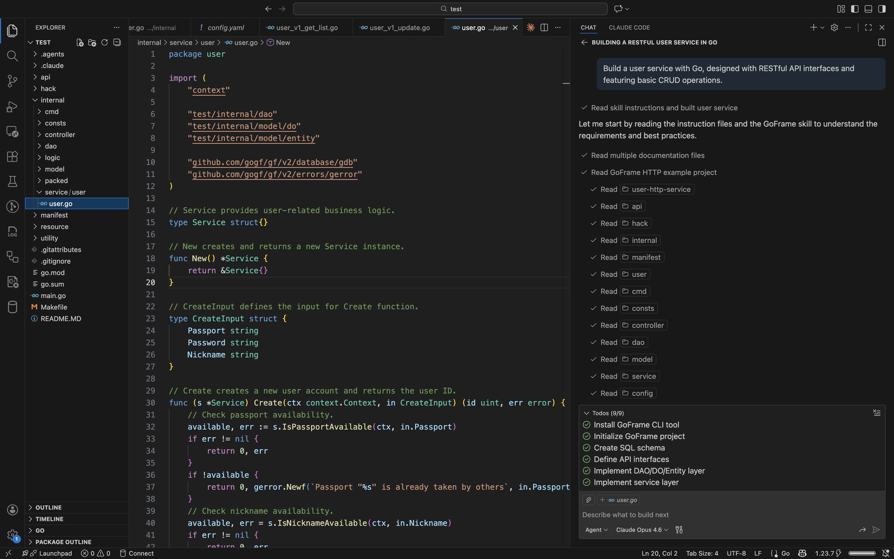
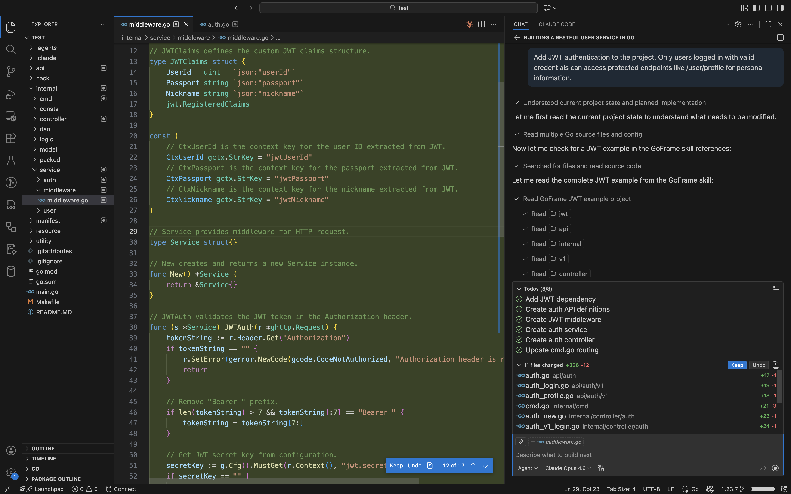

# GoFrame Skills

GoFrame Skills is an AI skill set tailored for the GoFrame framework, designed to enable AI to produce accurate GoFrame code. It provides:

- 📚 **Comprehensive Documentation**: Covers core components including CLI management, configuration, logging, error handling, database ORM, and more — with design overviews, usage guides, best practices, and caveats.
- 💡 **Rich Practical Examples**: Includes code examples for various project types such as HTTP services and gRPC microservices to help you get started quickly.
- 🤖 **AI-Powered Development**: Empowers AI to deeply understand GoFrame conventions and best practices, generating high-quality, production-ready code.

> 🚧 Currently in Beta — feel free to try it out and contribute via [Issues](https://github.com/gogf/skills/issues) and [Pull Requests](https://github.com/gogf/skills/pulls)!


## Installation

```bash
npx skills add github.com/gogf/skills
```

## Check Updates

```bash
npx skills check
```

## Install Updates

```bash
npx skills update
```

## Usage Example

> ℹ️ It's recommended to use Claude Opus 4.6 or later for optimal code generation.


### Create a new project with GoFrame skills

Prompt example:

```text
Build a user service with Go, designed with RESTful API interfaces and featuring basic CRUD operations.
```



### Create a new feature with GoFrame skills

Prompt example:

```text
Add JWT authentication to the project. Only users logged in with valid credentials can access protected endpoints like /user/profile for personal information.
```


